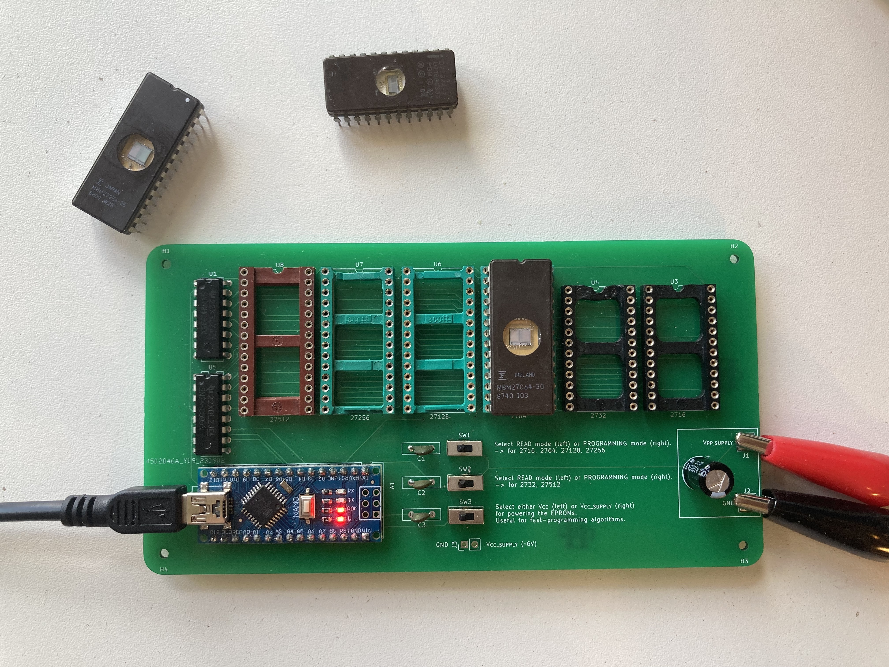

# Arduino-EPROM-serial-programmer

A project to program vintage EPROMs with modern Python and Arduino.

/!\ Work in progress. New version will include voltage regulators to generate the required programming voltages.



## Introduction

EPROMs are found in many old devices (scopes, data logger, computer). They are very good at long term data retention. And the good thing is they can be erased and re-programmed easily (with a bit of hardware).

Unfortunately, the devices for reading and programming EPROMs are usually expensive as they are universal: they can program almost all EPROMs. I really don't need such universal programmers as I use EPROMs for my hobby and I have only a few different types of EPROM.

## Description

A serial connection is opened between the computer and the arduino. This connection is used to transfer commands (read or write) and data (memory contents or machine code).

The circuit schematic is located [here](EPROM_FLASHER/Schematic.pdf).
It is based on an Arduino Nano, two 8-bit serial-in parallel-out shift registers (ref. 74HC595) and some passive components (condensator, 3 capacitors, 3 switches). Two soldering pads are present for powering the "program pin" of the EPROMs during a write operation.

The address lines of the EPROMs are driven by the shift registers whereas their data lines are driven by 8 Arduino pins.

## Installation

* Flash the [arduino program](arduino_programmer/arduino_programmer.ino) into the Arduino Nano. Use the Arduino IDE for this.
* Get yourself the PCB. You can directly upload the [zip file](EPROM_FLASHER/GERBER/EPROM_FLASHER.zip) to PCB production services.
* Solder the components on the PCB.
* Install a SINGLE EPROM on the board.

## Usage

* Connect the Arduino to the computer.
* For reading the EPROM run

```sh
python3 main.py -t X
```

where **X** is the memory type code (see [supported EPROMs](#supported-eproms)). The EPROM contents will be written in the file [epromContents_before.txt](epromContents_before.txt).

* For programming the EPROM run

```python
python3 main.py -t X -f path-to-the-machine-code-txt
```

where **X** is the memory type code (see [supported EPROMs](#supported-eproms)) and the path is indicating where you machine code is located.
Before programming, the program will pause and ask you to apply the programming voltage on the external supply pad. It will resume once you press the ENTER key.

## Example

A machine code example is located [here](programs/machineCode.txt). It is not a binary file but a txt files containing the program bytes on separate lines.

&rarr; If I want to read the contents of a NEC 2732D EPROM, I run

```sh
python3 main.py -t 32
```

&rarr; If I want to write the program [programs/machineCode.txt](programs/machineCode.txt) in the NEC 2732D EPROM, I run

```sh
python3 main.py -t 32 -f programs/machineCode.txt
```

I can see the contents of the EPROM in the file [epromContents_before.txt](epromContents_before.txt).

## Supported EPROMs

|EPROM|memory code|Memory Size [bytes]|
|---|---|---|
|27x16|16|2048|
|27x32|32|4096|
|27x64|64|8192|
|27x128|128|16384|
|27x256|256|32768|
|27x512|512|65536|

## Warning

DO NOT HOT-SWAP EPROM!

READ CAREFULLY THE DATASHEET FOR YOUR EPROM TO CHECK THE PROGRAMMING PROCEDURE AND VOLTAGE!

## Note

This project was made with components I had laying around. I didn't have a ZIF (Zero Insertion Force) socket for the EPROMs and this is the reason why I used 6 different sockets.

To keep the board simple, the programming voltage is not generated on the board, but  by an external power supply whose wires are attached to the power supply terminals.
